정태준(TAEJUNE JUNG)
================

* Email: tejayjung@gmail.com
* Github: [github.com/simajune](https://github.com/simajune)
* Blog: [https://simajune.github.io](https://simajune.github.io)

 

## 목차
* [경력](#경력)
* [교육](#교육)
* [프로젝트](#프로젝트)

 

## 경력

[**Cashwalk ,Inc**](https://www.cashwalk.co/)

> 누적 다운로드 1000만건을 달성한 '캐시워크' 및 '캐시닥'이라는 서비스의 iOS 팀에서 개발을 담당하고 있습니다.

* 기간: 2019.08 ~
* 직급: iOS Developer

[**SweetTracker**](https://http://www.sweettracker.co.kr/)

> 자동으로 쇼핑내역을 찾아 배송정보를 알려주는 택배조회 어플 '스마트택배'라는 서비스의 iOS개발을 담당했습니다.

* 기간: 2018.06 ~ 2019.08
* 직급: iOS Developer

[**EZDS**](https://http://www.e-zds.com/)

> 자동차 진단 장비인 G-scan 장비에 진단 소프트웨어를 개발을 담당했습니다.

* 기간: 2015.09 ~ 2017.07
* 직급: Software Engineer

[**(주)로킷**](https://rokithealthcare.com/)

> 국내 최초 데스크 탑 3D 프린터 3DISON 제품의 펌웨어 개발을 담당했습니다.

* 기간: 2014.02 ~ 2015.02
* 직급: Project Manager

 

## 교육

**패스트캠퍼스**

* iOS 개발 School 5기
* 기간: 2017년 9월 ~ 2018년 1월

 

## 프로젝트

**캐시닥**

> 금융 앱으로 신규 개발 단계부터 투입되어 개발을 한 프로젝트입니다. 아키텍처는 Clean architecture를 사용했고 로그인과 회원가입 기능을 구현 했고 계좌조회와 카드승인 내역을 통해 가계부리스트를 만들고 중복된 리스트는 제거하는 기능과 캐시 적립하는 기능, 그리고 가계부를 조회할 때 나오는 슬롯 머신의 기능을 구현했습니다.

* 회사 : Cashwalk,inc

* 개발 기술 : Swift, RxSwift, Realm, Firebase, Fastlane

* 담당 업무

  * 회원 가입 로그인 구현
  * 가계부 내역 스크래핑 및 카테고리 변경 기능 구현
  * 슬롯 머신 기능 구현
  * 더보기 탭 구현

* 홈페이지 : https://cashdoc.me

* 앱스토어 : https://apps.apple.com/app/id1483471584

    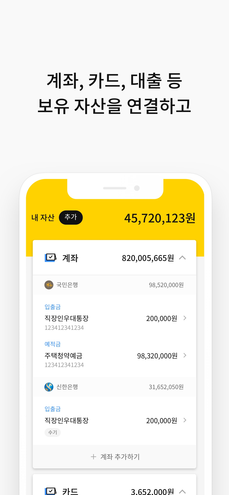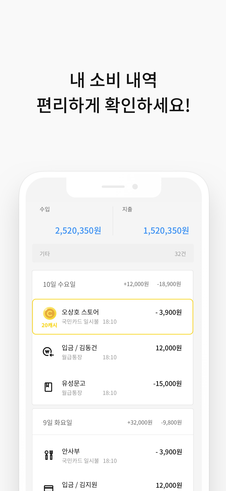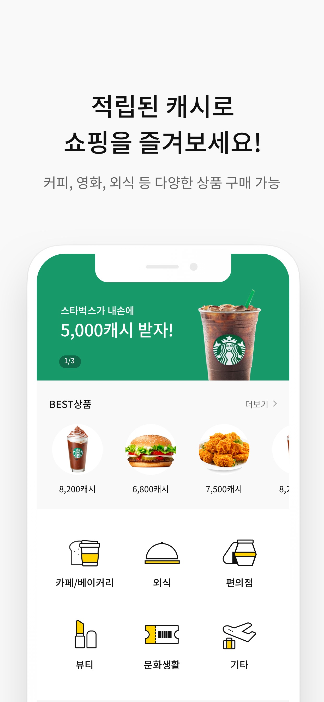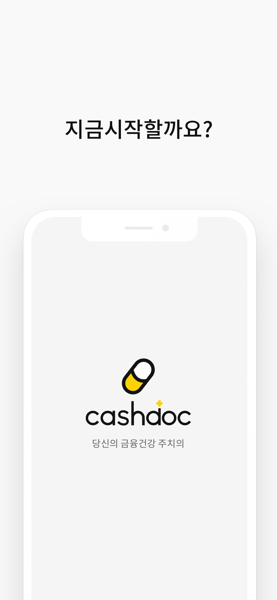

 

**스마트택배**

> 스윗트래커의 메인프로젝트로 누적 다운로드수 610만, 실제 사용자 300만명이 사용하는 어플리케이션으로 성장하였으며 광고 및 빅데이터 수집으로 ​한달 약 1억원의 수익 창출을 이뤘습니다. 초기 프로젝트는 100% Objective-C로 이루어져 있었고 신규 기능에 대한 것은 Swift로  진행했습니다. 	   총 2번의 리뉴얼 (쇼핑몰 불러오기, 배송/상품 상세)를 진행했고 배송 상품을 백업/복원할 수 있는 기능과 신고하기 기능에 대한 고도화 작업 등을 진행했습니다. iOS 개발자가 혼자여서 Swift로 이루어진 코드에 대해 리펙토링을 적극적으로 진행했고 일부 기능에 대해서는 RxSwift로 변환하고Objective-C로 구현된 부분은 틈틈히 Swift로 전환을 했습니다.

* 회사 : 스윗트래커
* 개발 기술 : Objective-C, Swift, RxSwift, CoreData
* 담당 업무
  * 스윗트래커 신규 기능 개발 및 유지보수
* 홈페이지 : http://www.sweettracker.co.kr/
* 앱스토어 : https://itunes.apple.com/kr/app/podcast/id523045854

 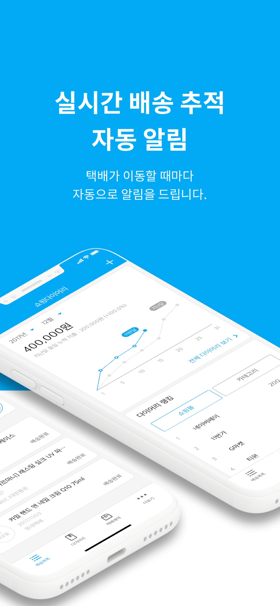 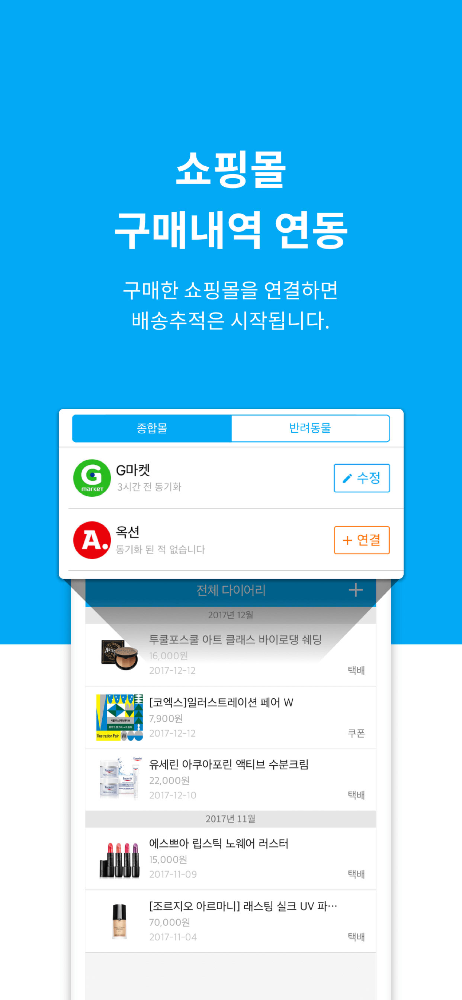 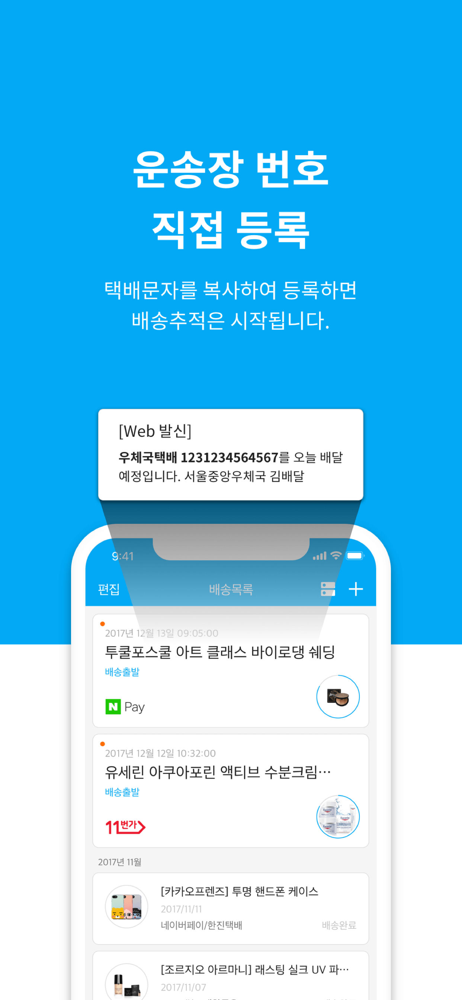 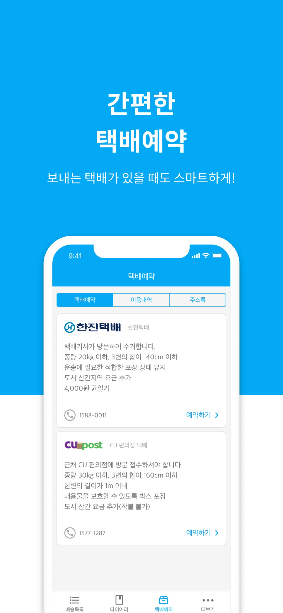

 

**홈픽**

> 처음 회사에 들어가 외주로 작업된 프로젝트로 처음 기획 단계부터 서비스 런칭까지 진행했습니다. 회사에 iOS 개발자가 1명 밖에 없었기 때문에 어려움이 많았지만 경험을 쌓을 수 있었습니다. 우선 Swift만 배웠던 상태에서 Objective-C로 처음에 구현을 하였고 나중에 진행하면서 추가되는 기능에 대해서는 Swift로 구현을 하여 비율이 약 Objective-C(70%), Swift(30%)정도입니다. 그리고 ISP 모듈을 이용한 결제서비스와 배송 기사의 위치를 보여주기 위해 구글 맵과 더불어 많은 라이브러리를 써볼 수 있는 기회였습니다. 그리고 API 문서를 Swagger를 사용하여 API 문서에 대해 익힐 수 있었습니다. 

* 회사 : 스윗트래커
* 개발 기술 : Objective-C, Swift, CoreData
* 담당 업무
  * 홈픽 신규 구현
  * 신규 기능 개발
* 앱스토어 : https://goo.gl/LkPW6S

 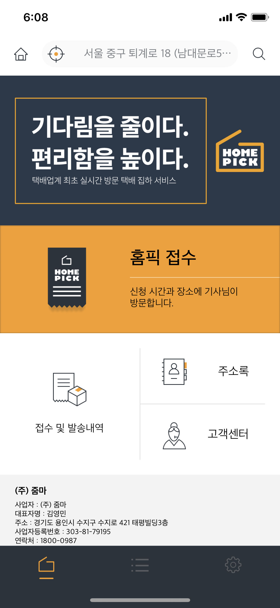 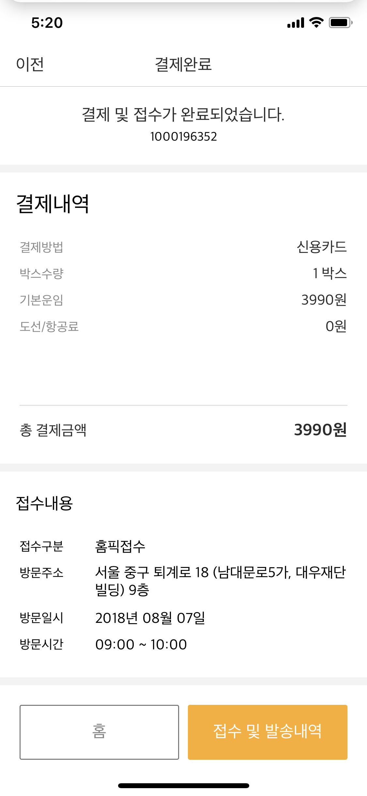 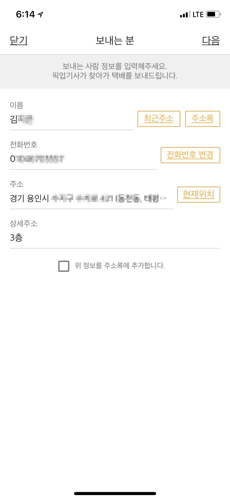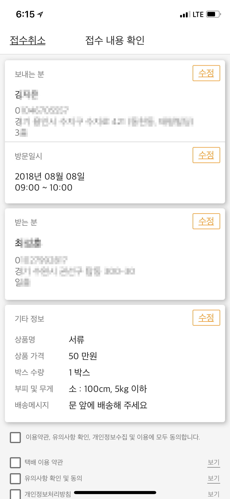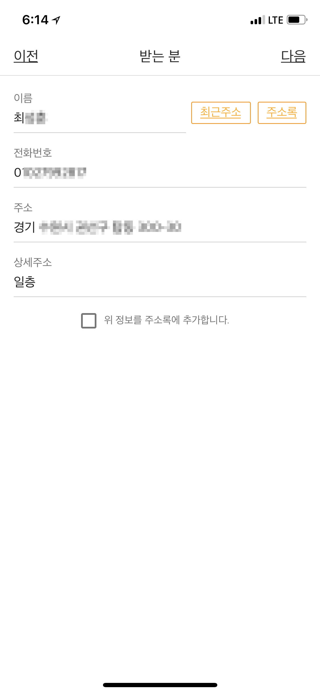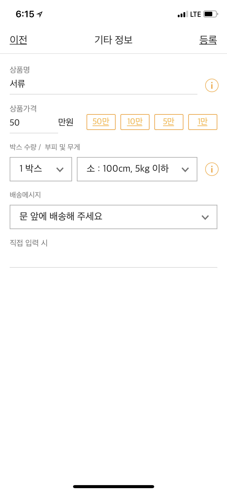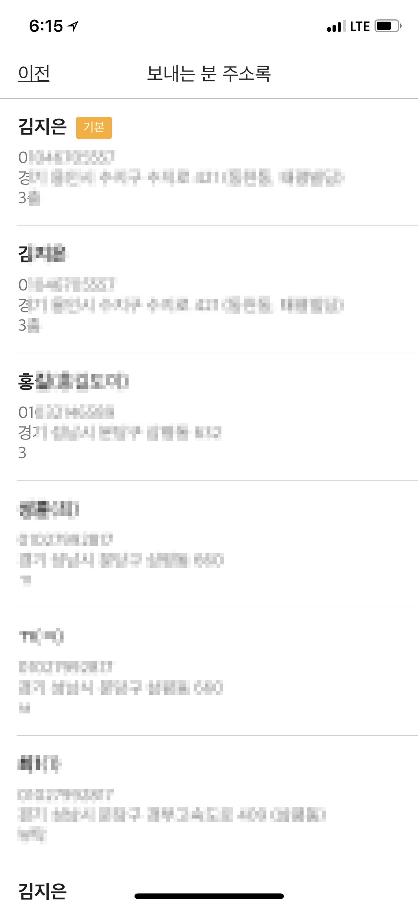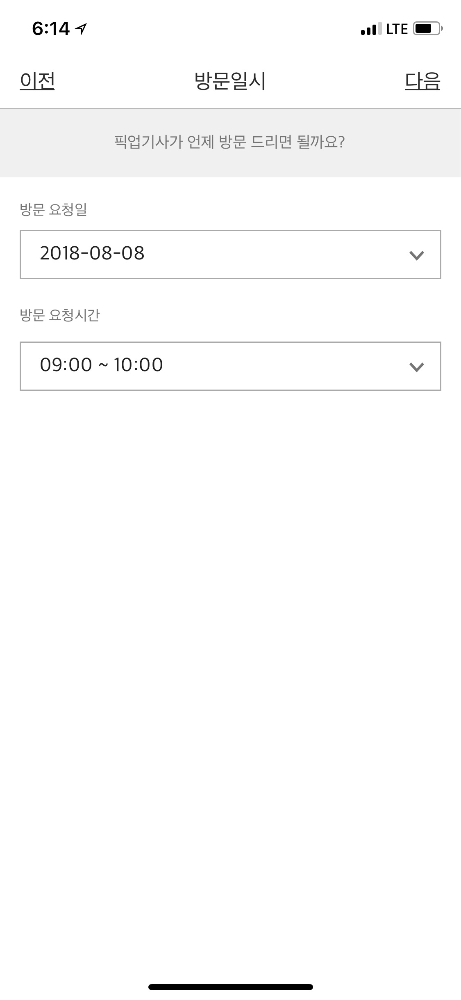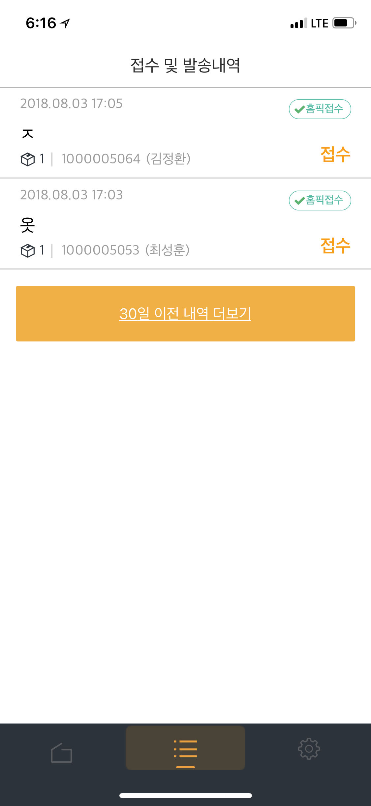

 

**날씨먼지**

> 날씨먼지는 실시간 날씨와 날씨예보 그리고 미세먼지정보를 제공합니다. 직관적인 UI로 한눈에 미세먼지의 정보와 날씨의 정보를 확인 하실 수 있습니다. 위젯을 통해 사용자의 현재위치를 파악하여 대기지수와 날씨의 정보를 제공합니다.

* 주요기능
  * 초,미세먼지(PM10, PM2.5)의 실시간 정보 (WHO 기준)
  * 대기오염(아황산가스, 오존, 일산화탄소, 이산화탄소)의 실시간 정보
  * 통합대기지수로 현재의 대기오염 상태
  * 해당 지역에 대한 현재 날씨에 대한 정보
  * 해당 지역에 대한 날씨예보 정보
  * 위젯을 통한 해당 지역에 대한 실시간 날씨와 대기의 정보
  * Coredata를 통한 최근 검색 기록 제공

* 개발 기술 : Swift, Coredata, Firebase
* 앱스토어 : https://goo.gl/bxKF4v

 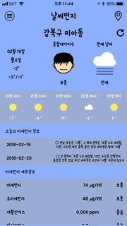 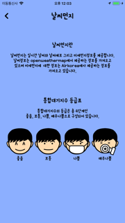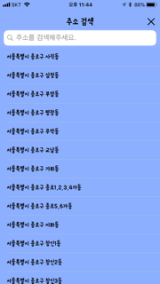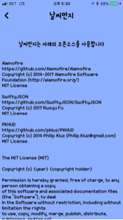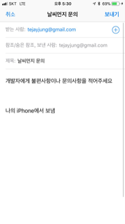

 

**FooPls**

> FooPls는 푸드 캘린더와 그것을 공유하는 SNS가 결합된 앱입니다. Splash View는 애니메이션 효과를 주기 위해 Core Animator라는 프로그램을 사용하였습니다. 실시간 데이터베이스, 스토리지 그리고 로그인 인증은  파이어베이스로 구현하였습니다.
>
> 회원가입과 로그인은 파이어베이스에서 제공하는 메인 인증, 페이스북 인증 그리고 카카오 통해서 가능합니다. 
>
> ( 카카오 회원 가입은 파이어베이스 가입 인증 지원이 안되기 때문에 Node.js를 통해 로컬 서버를 만들어 사용)
>
> Main은 Home, Search, Posting, Calendar, Information 5개의 View Controller로 구성하였습니다.
>
> HomeView은 CollectionView를 사용하여 사용자가 음식을 포스팅한 글을 볼 수 있고 글을 눌렀을 때는 그 글의  세부 내용을 확인 할 수 있습니다.
>
> Search View는 GooglePlacePicker를 사용하여 검색한 장소에 대한 포스팅이 있는지 없는지 검색합니다.
>
> Posting View은 사용자가 Calendar에 글을 쓸지 아니면 글을 Posting만 할지 결정합니다.
>
> Calendar는 해당 날짜에 글을 쓰고 글이 있는 날짜에는 글이 표시하고 그 날짜를 누르면 TableView를 Popup 시켜 해당 날짜에 쓴 글을 모두 보여 줍니다.
>
> Information은 사용자의 기본 정보를 보여줍니다. 사용자가 쓴 모든 글과 포스팅에서 좋아요를 누른 글을 CollectionView를 통해 보여주고 프로필 변경과 로그아웃을 할 수 있습니다.

* 개발 기술 : Swift, Firebase
* 담당 업무
  * 프로젝트 기획 및 디자인
  * 회원가입 및 로그인 구현
  * 메인 화면 구현
  * 캘린더 구현
  * 계정 정보 구현
  * firebase 구현

  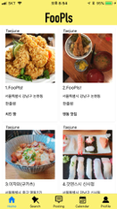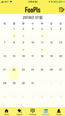

 

